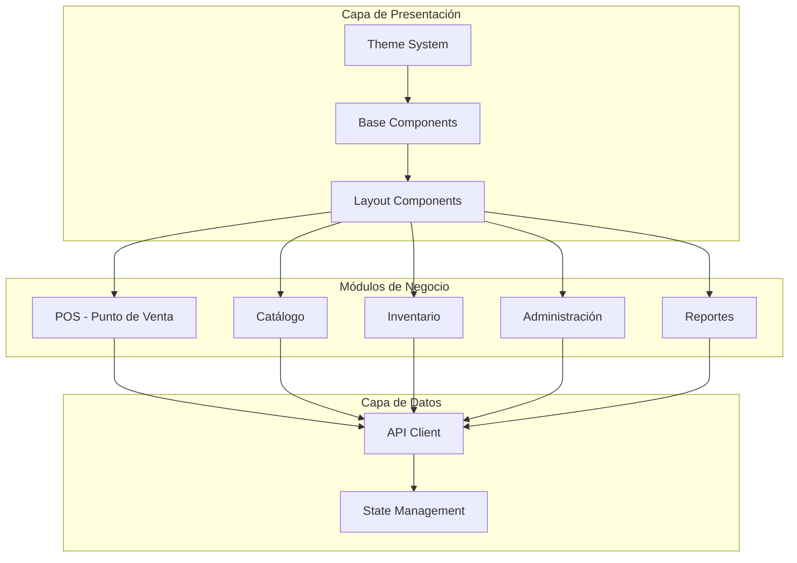

# Renovación Frontend - Librería Belén POS

## Resumen Ejecutivo

Este documento detalla el plan de renovación completa del frontend del sistema POS para Librería Belén. El objetivo es transformar la interfaz actual en una experiencia moderna, minimalista y profesional que transmita sofisticación y confianza.

**Tecnología Actual:** React 18 + TypeScript + Vite + MUI v5 + TanStack Query

---

## Objetivos de Diseño

### Principios Fundamentales

1. **Modernidad**: Tendencias de diseño actuales con bordes redondeados suaves, sombras sutiles y micro-interacciones
2. **Minimalismo**: Espacios negativos efectivos, jerarquía visual clara, eliminación de elementos innecesarios
3. **Profesionalismo**: Consistencia en todos los componentes, colores sobrios y confiables, tipografía legible

### Requisitos Específicos

- Interfaz intuitiva y fácil de usar
- Navegación fluida e intuitiva
- Paleta de colores coherente y profesional
- Tipografía legible con jerarquía clara
- Espaciado uniforme entre elementos
- Componentes consistentes y armoniosos
- Diseño completamente responsivo
- Grid flexible para cualquier tamaño de pantalla
- Información organizada lógicamente
- Formularios con validación visible clara
- Paneles de control accesibles

---

## Sistema de Diseño Propuesto

### 1. Paleta de Colores

#### Colores Principales (Profesional y Confiable)

```css
/* Primary - Azul Profundo Profesional */
--color-primary-50: #E8EEF4;
--color-primary-100: #C5D4E3;
--color-primary-200: #9FB8D0;
--color-primary-300: #799CBD;
--color-primary-400: #5C85AE;
--color-primary-500: #3F6E9F;
--color-primary-600: #325880;
--color-primary-700: #254261;
--color-primary-800: #1A3347;
--color-primary-900: #0F2330;

/* Secondary - Verde Esmeralda (Éxito/Confirmación) */
--color-secondary-50: #E8F5F3;
--color-secondary-100: #C5E6DF;
--color-secondary-200: #9ED5CA;
--color-secondary-300: #77C4B4;
--color-secondary-400: #59B7A3;
--color-secondary-500: #3BAA92;
--color-secondary-600: #2E8A76;
--color-secondary-700: #236A5B;
--color-secondary-800: #1A4B41;
--color-secondary-900: #11302B;

/* Neutral - Grises Cálidos ( Fondo ) */
--color-neutral-0: #FFFFFF;
--color-neutral-50: #FAFAFA;
--color-neutral-100: #F5F5F5;
--color-neutral-200: #EEEEEE;
--color-neutral-300: #E0E0E0;
--color-neutral-400: #BDBDBD;
--color-neutral-500: #9E9E9E;
--color-neutral-600: #757575;
--color-neutral-700: #616161;
--color-neutral-800: #424242;
--color-neutral-900: #212121;

/* Semánticos */
--color-success: #10B981;    /* Verde esmeralda brillante */
--color-warning: #F59E0B;     /* Ámbar */
--color-error: #EF4444;      /* Rojo vibrante */
--color-info: #3B82F6;        /* Azul brillante */

/* Fondo Principal */
--bg-primary: #F8FAFC;        /* Azul muy suave */
--bg-secondary: #F1F5F9;     /* Gris azulado claro */
--bg-surface: #FFFFFF;       /* Blanco puro */
--bg-elevated: #FFFFFF;
```

#### Aplicación de Colores

| Elemento | Color | Uso |
|----------|-------|-----|
| Primary Main | #1E3A5F | Botones principales, headers, acentos |
| Primary Light | #2D5A8A | Hover states, énfasis |
| Secondary | #0D9488 | Acciones secundarias, éxitos |
| Background | #F8FAFC | Fondo general de la app |
| Surface | #FFFFFF | Tarjetas, paneles, modales |
| Text Primary | #1E293B | Texto principal |
| Text Secondary | #64748B | Texto secundario, etiquetas |
| Border | #E2E8F0 | Bordes sutiles |
| Divider | #CBD5E1 | Separadores |

### 2. Sistema de Tipografía

#### Fuentes Propuestas

```css
/* Fuente Principal (UI) - Inter (más legible y moderna) */
--font-primary: 'Inter', -apple-system, BlinkMacSystemFont, 'Segoe UI', sans-serif;

/* Fuente Display (Títulos) - Plus Jakarta Sans */
--font-display: 'Plus Jakarta Sans', var(--font-primary);

/* Alternativa Premium - DM Sans */
--font-alt: 'DM Sans', var(--font-primary);
```

#### Escala Tipográfica

| Nivel | Tamaño | Line Height | Weight | Uso |
|-------|--------|-------------|--------|-----|
| Display | 48px | 1.2 | 700 | H1 - Títulos principales |
| H1 | 36px | 1.25 | 700 | Títulos de página |
| H2 | 28px | 1.3 | 600 | Títulos de sección |
| H3 | 22px | 1.35 | 600 | Títulos de subsección |
| H4 | 18px | 1.4 | 600 | Títulos de tarjetas |
| Body Large | 16px | 1.6 | 400 | Texto principal |
| Body | 14px | 1.5 | 400 | Texto general |
| Body Small | 13px | 1.5 | 400 | Texto secundario |
| Caption | 12px | 1.4 | 500 | Etiquetas, badges |
| Overline | 11px | 1.5 | 600 | Categorías |

### 3. Sistema de Espaciado

```css
/* Espaciado base (8px) */
--space-1: 4px;
--space-2: 8px;
--space-3: 12px;
--space-4: 16px;
--space-5: 20px;
--space-6: 24px;
--space-8: 32px;
--space-10: 40px;
--space-12: 48px;
--space-16: 64px;

/* Border Radius */
--radius-sm: 6px;
--radius-md: 10px;
--radius-lg: 14px;
--radius-xl: 20px;
--radius-full: 9999px;

/* Sombras */
--shadow-xs: 0 1px 2px rgba(0, 0, 0, 0.05);
--shadow-sm: 0 2px 4px rgba(0, 0, 0, 0.06);
--shadow-md: 0 4px 12px rgba(0, 0, 0, 0.08);
--shadow-lg: 0 8px 24px rgba(0, 0, 0, 0.12);
--shadow-xl: 0 16px 48px rgba(0, 0, 0, 0.16);
```

### 4. Breakpoints Responsivos

```css
--breakpoint-xs: 0;      /* Móviles pequeños */
--breakpoint-sm: 640px;  /* Móviles grandes */
--breakpoint-md: 768px;  /* Tablets */
--breakpoint-lg: 1024px; /* Laptops */
--breakpoint-xl: 1280px; /* Desktops */
--breakpoint-2xl: 1536px; /* Pantallas grandes */
```

---

## Componentes Base

### 1. Tarjetas (Cards)

- Fondo blanco puro
- Border radius: 16px
- Sombra sutil: `0 1px 3px rgba(0,0,0,0.08)`
- Padding: 24px
- Hover: sombra ligera + translateY(-2px)

### 2. Botones

| Tipo | Background | Border | Hover |
|------|------------|--------|-------|
| Primary | #1E3A5F | none | #2D5A8A |
| Secondary | #0D9488 | none | #0F766E |
| Outlined | transparent | #E2E8F0 | #F1F5F9 |
| Ghost | transparent | none | #F1F5F9 |

- Border radius: 10px
- Altura: 40px (md), 48px (lg)
- Transición: 150ms ease

### 3. Formularios

- Labels: texto secundario, tamaño 14px, font-weight 500
- Inputs: altura 44px, border-radius 10px
- Border: #E2E8F0, focus: #1E3A5F
- Validación: verde para válido, rojo para error
- Mensajes de error: color #EF4444, tamaño 12px

### 4. Tablas

- Header: fondo #F8FAFC, font-weight 600
- Filas alternadas: blanco / #F8FAFC
- Hover: #F1F5F9
- Border: #E2E8F0
- Padding: 12px 16px

### 5. Navegación Sidebar

- Ancho expandido: 260px
- Ancho colapsado: 72px
- Fondo: #FFFFFF
- Items activos: fondo #E0E7FF, indicador izquierdo #1E3A5F
- Iconos: 20px, color #64748B

---

## Renovación por Módulo

### Módulo 1: Punto de Venta (POS)

**Componentes principales:**
- Panel de búsqueda de productos
- Carrito de compras
- Métodos de pago
- Historial de ventas

**Mejoras propuestas:**
- Diseño de dos columnas: búsqueda (60%) | carrito (40%)
- Cards de productos en grid 3-4 columnas
- Botones de acción grandes y táctiles
- Resumen de totales siempre visible
- Animaciones suaves al agregar productos

### Módulo 2: Catálogo

**Componentes:**
- Lista de productos (DataGrid)
- Formulario de producto
- Clientes
- Listas de precios
- Promociones

**Mejoras:**
- DataGrid con filas más espaciosas
- Filtros avanzados en panel lateral
- Wizard para crear productos
- Cards de promoción más visuales
- Mejor gestión de imágenes

### Módulo 3: Inventario

**Componentes:**
- Stock actual
- Compras
- Proveedores
- Almacenes

**Mejoras:**
- Dashboard de inventario con KPIs
- Alertas visuales de stock bajo
- Importación/exportación de Excel
- Historial de movimientos

### Módulo 4: Administración

**Componentes:**
- Usuarios
- Permisos
- Configuración
- Plantillas de documentos

**Mejoras:**
- UI más limpia para gestión de usuarios
- Tablas de permisos más intuitivas
- Configuración por secciones

### Módulo 5: Reportes

**Componentes:**
- Dashboard de métricas
- Gráficos de ventas
- Informes financieros

**Mejoras:**
- Gráficos más modernos (líneas suaves, colores vibrantes)
- Filtros por rango de fecha
- Exportación a PDF/Excel

---

## Plan de Implementación

### Fase 1: Fundamentos (Días 1-2)

1. Actualizar `theme.ts` con nueva paleta de colores
2. Actualizar `index.css` con variables CSS
3. Definir nuevos componentes base
4. Crear sistema de spacing

### Fase 2: Layout Principal (Días 3-4)

1. Rediseñar `AppLayout.tsx`
2. Mejorar navegación sidebar
3. Optimizar responsive design
4. Agregar animaciones de transición

### Fase 3: Módulos Core (Días 5-10)

1. Renovación POS
2. Renovación Catálogo
3. Renovación Inventario
4. Renovación Administración
5. Renovación Reportes

### Fase 4: Refinamiento (Días 11-12)

1. Testing responsivo
2. Optimización de performance
3. Ajustes visuales finales
4. Documentación

---

## Diagrama de Arquitectura de Componentes



---

## Consideraciones Técnicas

### Performance

- Code splitting por módulo
- Lazy loading de componentes pesados
- Optimización de imágenes
- Memoización de componentes

### Accesibilidad

- Contraste de colores WCAG AA
- Navegación por teclado
- Labels descriptivos
- Estados de focus visibles

### Mantenibilidad

- Componentes atómicos
- Props typing estricto
- Documentación de componentes
- Storybook opcional

---

## Próximos Pasos

1. **Aprobación del plan**: Confirmar dirección del diseño
2. **Inicio de implementación**: Cambiar al modo Code
3. **Iteración**: Revisión por módulos
4. **Testing**: Verificación en diferentes dispositivos

---

*Documento creado para la renovación del frontend de Librería Belén POS*
*Versión: 1.0*
